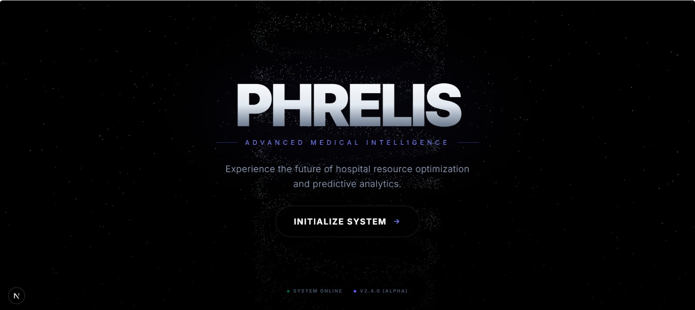
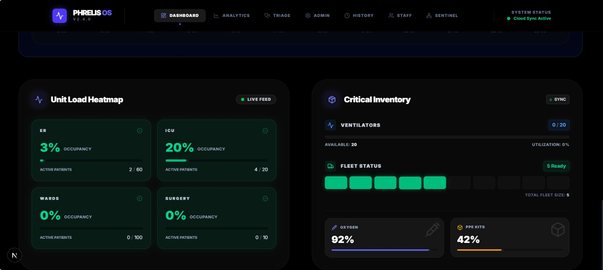
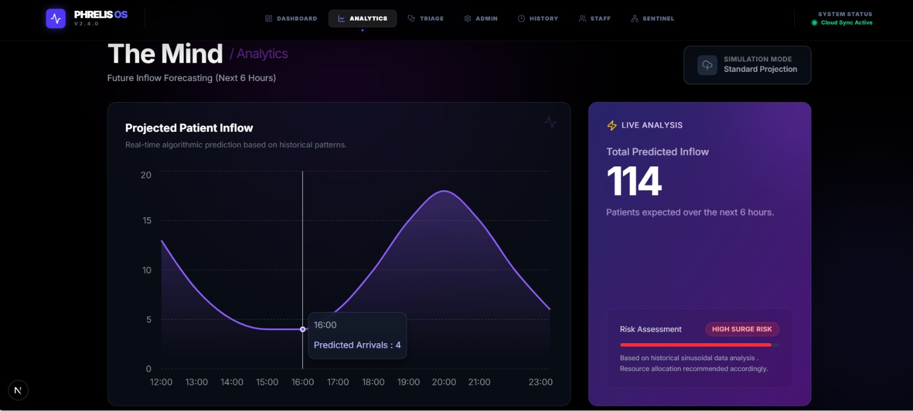
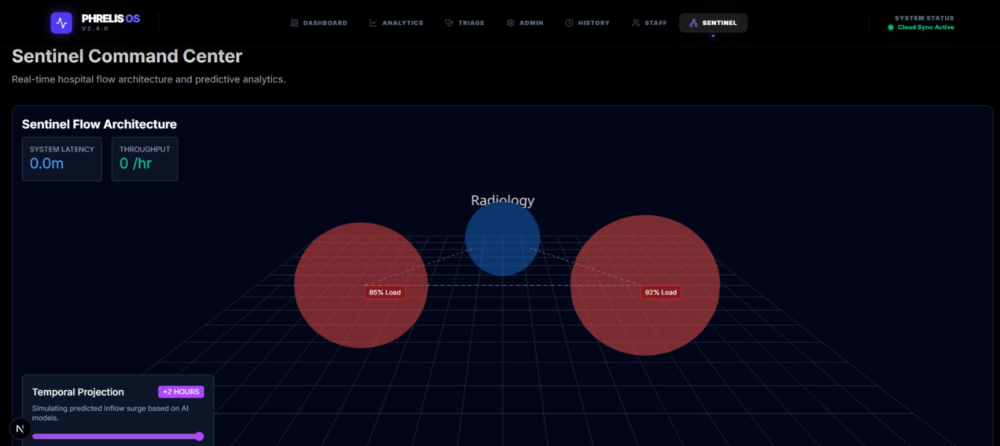
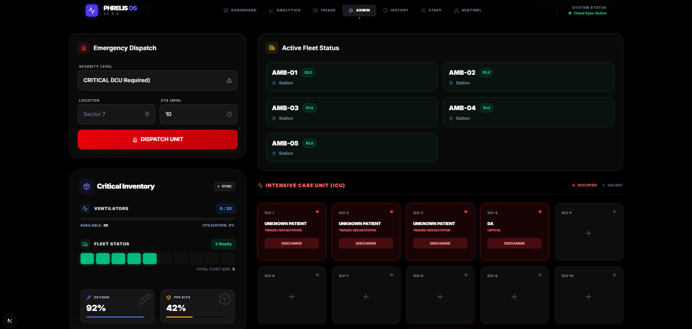
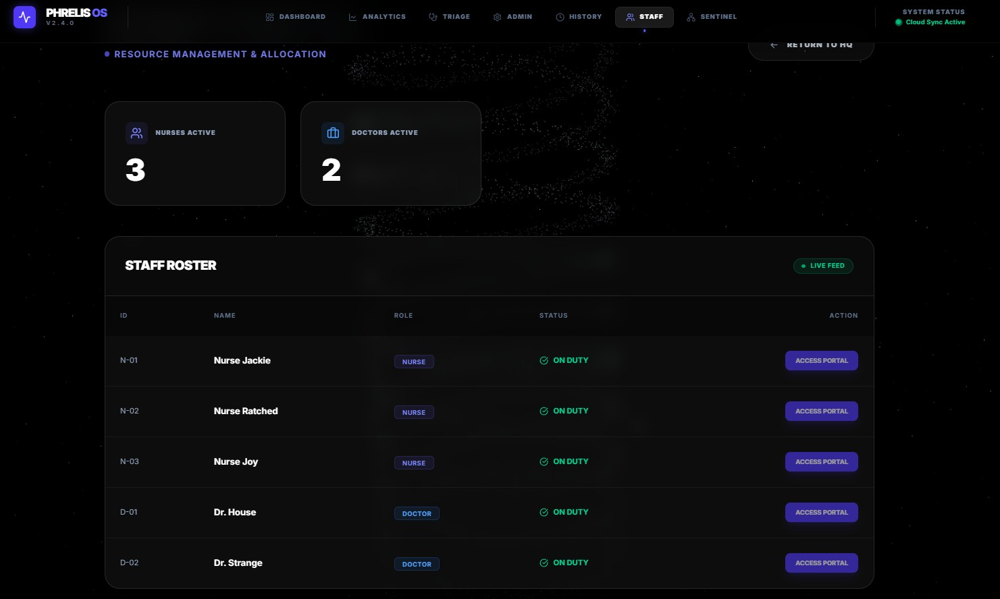
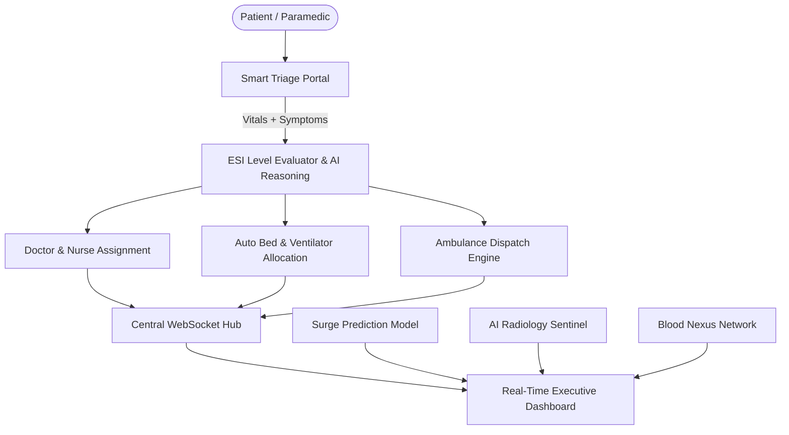

# 🏥 PHRELIS – Predictive Hospital Resource & Emergency Load Intelligence System

> **Advanced AI-Powered Hospital Operating System & Enterprise Resource Planning (ERP)**
> *Transforming Reactive Healthcare into Predictive, Data-Driven, and Intelligent Operations.*

---

## 📌 Executive Summary

Modern healthcare infrastructure faces critical operational challenges: unexpected emergency patient surges, ICU bed and ventilator deficits, physician and nursing burnout, delays in emergency fleet dispatch, and fragmented blood supply chains.

**PHRELIS** (Predictive Hospital Resource & Emergency Load Intelligence System) is a comprehensive, next-generation Hospital Operating System (HOS) and ERP built with **FastAPI**, **Next.js 16**, **PyTorch**, **Scikit-Learn**, **Google Gemini**, and **WebSockets**. PHRELIS unifies clinical triage, predictive capacity analytics, real-time bed and ventilator allocation, OPD queue management, blood nexus inventory, AI radiology diagnosis, billing automation, and ambulance fleet routing into a single synchronized ecosystem.

---

## 📸 System Visual Tour

| **Module** | **Interface Preview** |
| :--- | :--- |
| **Landing Page & System Hub** |  |
| **Executive ERP Dashboard** |  |
| **Smart Triage & Admission** |  |
| **AI Surge Prediction** |  |
| **Sentiment & Command Center** |  |
| **Bed & Resource Management** |  |
| **Staff Workload Allocation** |  |

---

## 🌟 Key Architecture & Operational Modules



### 1. 🩺 AI Smart Triage & Emergency Admission (ESI 1–5)
- **Vitals Processing**: Accepts SpO₂, heart rate, blood pressure, respiratory rate, body temperature, and unstructured symptom text.
- **Intelligent ESI Grading**: Automatically calculates Emergency Severity Index (ESI 1 through 5).
- **Automated Resource Provisioning**:
  - Immediate ICU / ER / Ward bed assignment.
  - Automatic ventilator reservation for severe cases (ESI-1/2 or low SpO₂).
  - Matches attending doctors based on specialty, shift status, and current caseload.
  - Assigns nursing teams maintaining safe patient-to-nurse ratios.
- **Clinical Reasoning**: Generates clinical justifications using Google Gemini AI models.

### 2. 🩻 AI Radiology Diagnostic Sentinel
- **Deep Learning Medical Vision**: Powered by PyTorch (`DenseNet` architecture).
- **Instant Scan Analysis**: Evaluates chest X-rays and CT scans to detect key pathologies (Pneumonia, Effusion, Pneumothorax, Consolidation).
- **Emergency Escalation**: Automatically flags abnormal scans for high-priority radiologist review.

### 3. 📈 Emergency Surge & Capacity Prediction
- **Machine Learning Engine**: Powered by Scikit-Learn (`inflow_model.pkl`).
- **Predictive Analytics**: Forecasts emergency inflow by analyzing historical trends, day of the week, weather patterns, and local emergency signals.
- **Proactive Resource Planning**: Enables hospital administrators to prepare staffing and inventory ahead of predicted surges.

### 4. 🩸 Blood Nexus Supply & Inventory Management
- **Component Tracking**: Monitors Packed Red Blood Cells (PRBC), Fresh Frozen Plasma (FFP), Platelets, and Cryoprecipitate.
- **Blood Group Matching**: Cross-matches A+, A-, B+, B-, AB+, AB-, O+, O- with universal donor/recipient safety logic.
- **Blood Reservation & Bed-side Dispatch**: Reserves blood bags for scheduled surgeries and emergency transfusions.
- **Donor Registry & Certification**: Tracks donor donation history, manages blood donation camps, and issues digital certificates.

### 5. 🏥 OPD Intelligent Queue & Priority Routing
- **ICD-10 Code Integration**: Search and validation for standardized medical diagnostic codes.
- **Dynamic Priority Scoring**: Queues patients based on clinical severity, age, and arrival time.
- **Consultation Room Routing**: Dispatches queued patients to available consultation rooms and updates room status upon completion.

### 6. 🔪 Operating Theater (OT) & Surgery Suite
- **Surgery Life-cycle**: Manages surgery creation, execution, time extension, and completion.
- **Consumable Auto-Deduction**: Automatically deducts surgical consumables (OR prep kits, sterile gowns, anesthesia, sutures) from inventory upon surgery start.
- **Turnover & Cleaning Workflow**: Marks beds and operating rooms as "Cleaning" post-procedure, triggering automated sanitation tasks.

### 7. 💳 Billing, Finance & Consumables Engine
- **Automated Billing Calculation**: Calculates itemized patient bills combining daily bed category tariffs, surgery fees, consumable usage, and applicable taxes.
- **PDF Generation**: Generates official hospital bills using `xhtml2pdf` and `Jinja2` templates.
- **Financial Analytics**: Real-time revenue reporting across hospital departments.

### 8. 🚑 Smart Fleet Ambulance Dispatch
- **Automated Emergency Dispatch**: Triggers ambulance assignment for ESI-1 and ESI-2 referrals.
- **Fleet Tracking**: Tracks status of ambulances (*Available*, *Dispatched*, *In Transit*, *Maintenance*).

### 9. 🔐 Security, Audit Logging & RBAC
- **Role-Based Access Control**: Hierarchical JWT token authentication supporting `Admin`, `Doctor`, `Nurse`, `Receptionist`, `Pharmacist`, `Lab Tech`, `Finance`.
- **System Audit Trail**: Logs critical clinical actions, inventory modifications, and user access events.

### 10. ⚡ Real-Time WebSocket Synchronization
- Centralized WebSocket server (`/ws`) pushing instant updates to all connected frontends without manual browser refreshes.

---

## 📂 Project Directory & Workspace Structure

The project has been organized into a modular, clean folder hierarchy:

```
Phrelis_ERP-main/
│
├── README.md                      # Primary Documentation
├── .gitignore                     # Git Exclusions
│
├── images/                        # Visual Screenshots & Asset Media
│   ├── landing_page.jpeg
│   ├── dashboard_page.jpeg
│   ├── Smart Triage Portal.jpg
│   ├── prediction_page.jpeg
│   ├── sentiment_command_center.jpeg
│   ├── ERP.jpg
│   └── Staff.jpg
│
├── backend/                       # FastAPI Backend Engine
│   ├── main.py                    # Main FastAPI Application & API Endpoints
│   ├── models.py                  # SQLAlchemy ORM Database Schemas
│   ├── database.py                # Database Engine & Session Management
│   ├── auth_middleware.py         # JWT Authentication & RBAC Middleware
│   ├── billing_service.py         # Financial & Billing Calculation Service
│   ├── blood_service.py           # Blood Bank & Inventory Allocation Engine
│   ├── infrastructure.py          # Hospital Infrastructure & Facility Monitor
│   ├── inventory_service.py       # Pharmacy & Supply Chain Inventory Service
│   ├── seed.py                    # Master Database Seeding Script
│   ├── hospital_os.db             # Primary SQLite Database File
│   ├── requirements.txt           # Python Package Dependencies
│   ├── .env                       # Environment Variables Configuration
│   ├── inflow_model.pkl           # Trained Inflow Prediction ML Model
│   ├── radiology_model.pkl        # PyTorch Radiology Model Weights
│   │
│   ├── scripts/                   # System Administration & Maintenance Scripts
│   │   ├── migrations/            # DB Schema Migration Scripts
│   │   │   ├── migrate_blood_nexus.py
│   │   │   ├── migrate_db.py
│   │   │   ├── migrate_history.py
│   │   │   ├── migrate_rbac.py
│   │   │   ├── fix_patients_schema.py
│   │   │   ├── fix_schema.py
│   │   │   ├── fix_surgery_schema.py
│   │   │   └── init_financial_tables.py
│   │   │
│   │   ├── patches/               # Fix & Patch Utility Scripts
│   │   │   ├── patch_ambulance_roles.py
│   │   │   ├── patch_beds_blood.py
│   │   │   ├── patch_blood_prices.py
│   │   │   ├── patch_blood_seed.py
│   │   │   ├── patch_db.py
│   │   │   ├── patch_nd_seed.py
│   │   │   ├── patch_patient_ref.py
│   │   │   └── fix_existing_admissions.py
│   │   │
│   │   └── utilities/             # Helper & Verification Tools
│   │       ├── admit_dummy.py
│   │       ├── check_db_integrity.py
│   │       ├── check_schema.py
│   │       ├── check_users.py
│   │       ├── create_test_users.py
│   │       ├── debug_blood_reserve.py
│   │       ├── debug_seeder.py
│   │       ├── debug_traceback.py
│   │       ├── final_receptionist_sync.py
│   │       ├── force_seed.py
│   │       ├── get_revenue_stats.py
│   │       ├── get_stats.py
│   │       ├── inspect_db.py
│   │       ├── simulate_capacity.py
│   │       └── update_surgery_data.py
│   │
│   ├── tests/                     # Backend Automated Test Suite
│   │   ├── test_admission.py
│   │   ├── test_audit_logging.py
│   │   ├── test_b_plus.py
│   │   ├── test_billing_flow.py
│   │   ├── test_clinical_core.py
│   │   ├── test_gemini.py
│   │   ├── test_icd_yellow.py
│   │   ├── test_inventory.py
│   │   ├── test_opd_billing.py
│   │   ├── test_opd_concurrency.py
│   │   ├── test_opd_flow.py
│   │   ├── test_triage_logic.py
│   │   ├── test_all_uids.py
│   │   ├── test_deduction_flow.py
│   │   ├── test_forecast.py
│   │   ├── test_request.py
│   │   └── reproduce_bug.py
│   │
│   └── debug_dumps/               # System Output Logs & JSON Dumps
│       ├── debug_stats.json
│       └── res.json
│
└── frontend/                      # Next.js 16 Web Application
    ├── app/                       # App Router Pages & Layouts
    │   ├── page.tsx               # Public Landing Page
    │   ├── login/                 # User Authentication Portal
    │   ├── dashboard/             # Executive ERP Dashboard
    │   ├── triage/                # Smart Patient Triage Module
    │   ├── command-centre/        # Real-time Command Center
    │   ├── queue/                 # OPD Queue Routing Page
    │   ├── radiology/             # Radiology Diagnostic Portal
    │   ├── blood-nexus/           # Blood Bank Management Portal
    │   ├── predictions/           # Predictive Analytics View
    │   ├── reception/             # Patient Registration Desk
    │   ├── staff/                 # Staff Duty & Allocation View
    │   ├── history/               # Operational Logs & Records
    │   ├── admin/                 # RBAC & System Settings
    │   └── driver/                # Ambulance Fleet Portal
    │
    ├── components/                # Reusable UI Components & Widgets
    ├── context/                   # Global React Context & WebSocket Providers
    ├── public/                    # Static Assets & Icons
    ├── types/                     # TypeScript Interface & Type Definitions
    ├── utils/                     # Client Utilities & API Callers
    ├── next.config.ts             # Next.js Configuration
    ├── package.json               # Node.js Dependencies & Scripts
    └── tsconfig.json              # TypeScript Configuration
```

---

## 🛠 Tech Stack

### Backend Technologies
- **Framework**: [FastAPI](https://fastapi.tiangolo.com/) (Python 3.10+)
- **ORM & Database**: [SQLAlchemy](https://www.sqlalchemy.org/) & [SQLite](https://www.sqlite.org/) (PostgreSQL ready)
- **AI & Reasoning**: [Google Gemini API](https://ai.google.dev/) via `langchain-google-genai`
- **Machine Learning**: [PyTorch](https://pytorch.org/) (Radiology DenseNet model), [Scikit-Learn](https://scikit-learn.org/) (Inflow forecasting)
- **Authentication**: JWT (`python-jose`) & `passlib` bcrypt hashing
- **Document Generation**: `xhtml2pdf` & `jinja2`
- **Realtime**: WebSockets (`starlette.websockets`)

### Frontend Technologies
- **Framework**: [Next.js 16](https://nextjs.org/) (React 19, App Router)
- **Language**: [TypeScript](https://www.typescriptlang.org/)
- **Styling**: [Tailwind CSS v4](https://tailwindcss.com/) & `styled-components`
- **Animations & 3D**: `framer-motion`, `@react-three/fiber`, `@react-three/drei`, `three.js`
- **Data Visualization**: `recharts`
- **Icons & UI**: `lucide-react`, `react-hot-toast`, `next-themes`
- **Data Fetching**: `swr`

---

## ⚙️ Installation & Setup Guide

### Prerequisites
- **Node.js**: `v18.x` or higher
- **Python**: `v3.10` or higher
- **Git**: Installed on your system

---

### 1️⃣ Repository Clone
```bash
git clone https://github.com/Vivaan2756/GLOBAL_INNOVATION.git
cd Phrelis_ERP
```

---

### 2️⃣ Backend Setup (FastAPI)

Navigate to the `backend/` directory:
```bash
cd backend
```

Create and activate a Python virtual environment:
```bash
# Windows
python -m venv venv
venv\Scripts\activate

# Linux / macOS
python3 -m venv venv
source venv/bin/activate
```

Install the backend dependencies:
```bash
pip install -r requirements.txt
```

Set up Environment Variables:
Create a `.env` file inside the `backend/` directory:
```env
GOOGLE_API_KEY=your_google_gemini_api_key_here
SECRET_KEY=your_jwt_secret_key_here
ALGORITHM=HS256
ACCESS_TOKEN_EXPIRE_MINUTES=1440
DATABASE_URL=sqlite:///./hospital_os.db
```

Seed the Database (Initial Beds, Doctors, Inventory, Blood Bank):
```bash
python seed.py
```

Start the FastAPI backend server:
```bash
uvicorn main:app --reload --host 0.0.0.0 --port 8000
```

The backend server will run at `http://localhost:8000`.  
Interactive API Docs (Swagger UI) are available at `http://localhost:8000/docs`.

---

### 3️⃣ Frontend Setup (Next.js)

Open a new terminal window and navigate to the `frontend/` directory:
```bash
cd frontend
```

Install Node.js dependencies:
```bash
npm install
```

Start the Next.js development server:
```bash
npm run dev
```

The frontend application will run at `http://localhost:3000`.

---

## 📑 Core API Reference

Below is a summary of major endpoints provided by the backend:

### 🔐 Authentication & Admin
- `POST /api/login` - Authenticate user & receive JWT token.
- `POST /api/logout` - Revoke authentication session.
- `GET /api/admin/audit-logs` - Retrieve system audit trail logs.

### 🩺 Smart Triage & Admissions
- `POST /api/triage/assess` - Assess vitals & calculate ESI level.
- `POST /api/erp/admit` - Admit patient, allocate bed, doctor & staff.
- `GET /api/erp/beds` - Retrieve live bed status matrix.
- `POST /api/erp/discharge/{bed_id}` - Discharge patient & process final bill.
- `POST /api/erp/beds/{bed_id}/start-cleaning` - Initiate bed cleaning state.
- `POST /api/erp/beds/{bed_id}/cleaning-complete` - Mark bed available.

### 🩻 Radiology AI Sentinel
- `POST /api/radiology/scan/{patient_id}` - Upload & analyze medical radiology scan.

### 🩸 Blood Nexus
- `GET /api/blood/inventory` - Current stock of blood bags by type.
- `POST /api/blood/donate` - Record blood donation.
- `POST /api/blood/requests` - Submit blood request for patient/surgery.
- `POST /api/blood/reserve` - Reserve compatible blood bag for patient.
- `POST /api/blood/assign-to-bed` - Dispatch blood bag to bed.
- `GET /api/blood/donors` - Retrieve registered donor list.

### 🔪 Operating Theater & Surgeries
- `POST /api/surgery/start` - Begin surgery, allocate OT & deduct consumables.
- `POST /api/surgery/complete/{bed_id}` - Complete surgery & log post-op status.

### 📊 OPD Queue Management
- `POST /api/queue/checkin` - Patient check-in to OPD queue.
- `GET /api/queue/sorted` - Sorted OPD queue based on priority score.
- `POST /api/queue/call/{patient_id}` - Call patient into consultation room.

---

## ⚡ WebSocket Event Specification

Connect to `ws://localhost:8000/ws` to receive live system updates:

```json
{
  "event": "BED_STATUS_CHANGE",
  "data": {
    "bed_id": "ICU-01",
    "status": "OCCUPIED",
    "patient_name": "John Doe",
    "timestamp": "2026-09-24T20:30:00Z"
  }
}
```

Other broadcast events include `INVENTORY_ALERT`, `TRIAGE_ADMISSION`, `SURGERY_UPDATE`, and `BLOOD_RESERVATION`.

---

## 🧪 Running Tests & Diagnostics

To execute the backend test suite:

```bash
cd backend
python -m unittest discover -s tests
```

To run a specific test script (e.g., triage logic):
```bash
python -m tests.test_triage_logic
```

---

## 🛠 Useful Administrative Scripts

All helper scripts are neatly grouped under `backend/scripts/`:

- **Database Seed**: `python backend/seed.py`
- **Inspect Database**: `python backend/scripts/utilities/inspect_db.py`
- **Check Users**: `python backend/scripts/utilities/check_users.py`
- **Simulate Capacity**: `python backend/scripts/utilities/simulate_capacity.py`
- **Run Migrations**: `python backend/scripts/migrations/migrate_db.py`

---

## 🤝 Contributing

Contributions are welcome! Please follow these steps:
1. Fork the repository.
2. Create your feature branch (`git checkout -b feature/AmazingFeature`).
3. Commit your changes (`git commit -m 'Add some AmazingFeature'`).
4. Push to the branch (`git push origin feature/AmazingFeature`).
5. Open a Pull Request.

---

## 📜 License

Distributed under the MIT License. See `LICENSE` for more information.

---

<p align="center">
  <b>Built with ❤️ by Team Apicalypse</b>
</p>
